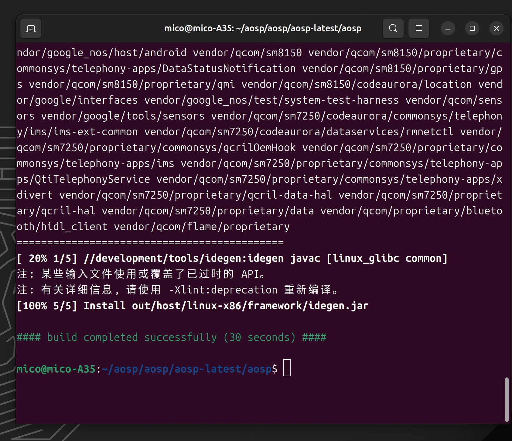
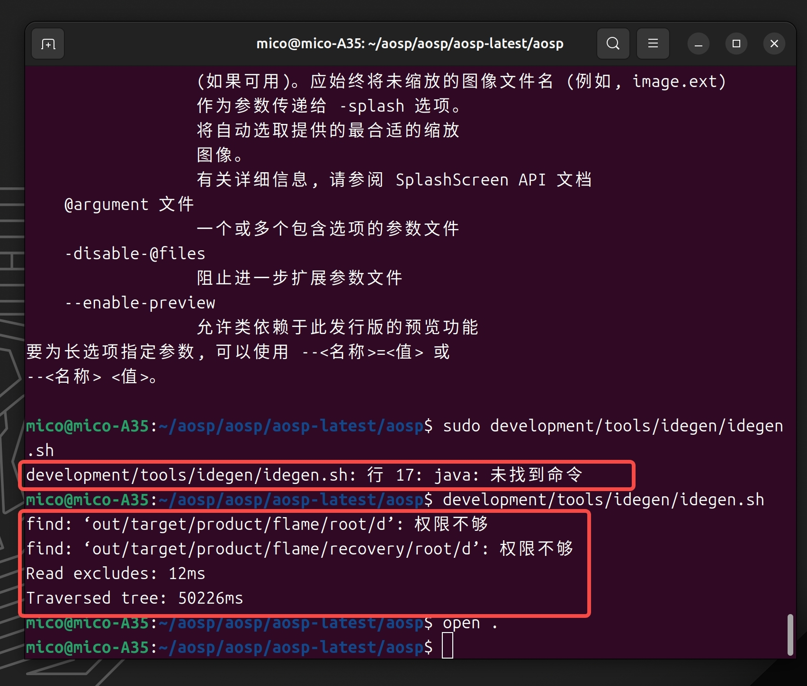

参考文档：  
https://blog.csdn.net/xct841990555/article/details/119131460  
https://blog.csdn.net/jiangxinnju/article/details/113923875

# 1.在源码中生成android studio 环境

下载好全包源码后，在源码根目录执行以下四条命令：

1. "source build/envsetup.sh" (source可以用 . 代替，即". build/envsetup.sh")
```shell
source build/envsetup.sh
```
2. "lunch"，并选择要编译的项目
```shell
lunch
```

3. "make idegen -j4" (这里的 -j4 表示用4线程来编译，可以不加)
```shell
make idegen -j4
```



4. "sudo development/tools/idegen/idegen.sh"
```shell
sudo development/tools/idegen/idegen.sh
```
## error development/tools/idegen/idegen.sh: 行 17: java: 未找到命令
解决：  
参考：https://blog.csdn.net/jiangxinnju/article/details/113923875  
执行development/tools/idegen/idegen.sh，可能会提示权限相关问题，如果没有中断程序可以暂时忽略，有的教程建议增加sudo前缀提升命令执行权限，这里不推荐，因为之前如果source build/envsetup.sh是以普通用户执行的，所有的构建环境都是以普通用户为前提的，提升权限可能会导致问题，比如java: 未找到命令



完成以上四个步骤之后，会发现在源码根目录下出现了三个新的文件(也有可能是两个)
```
1. android.iml (记录项目所包含的module、依赖关系、SDK版本等等，类似一个XML文件)

2. android.ipr (工程的具体配置，代码以及依赖的lib等信息，类似于Visual Studio的sln文件)

3. android.iws (主要包含一些个人的配置信息，也有可能在执行上述操作后没有生成，这个没关系，在打开过一次项目之后就会自动生成了)

```


---------------
