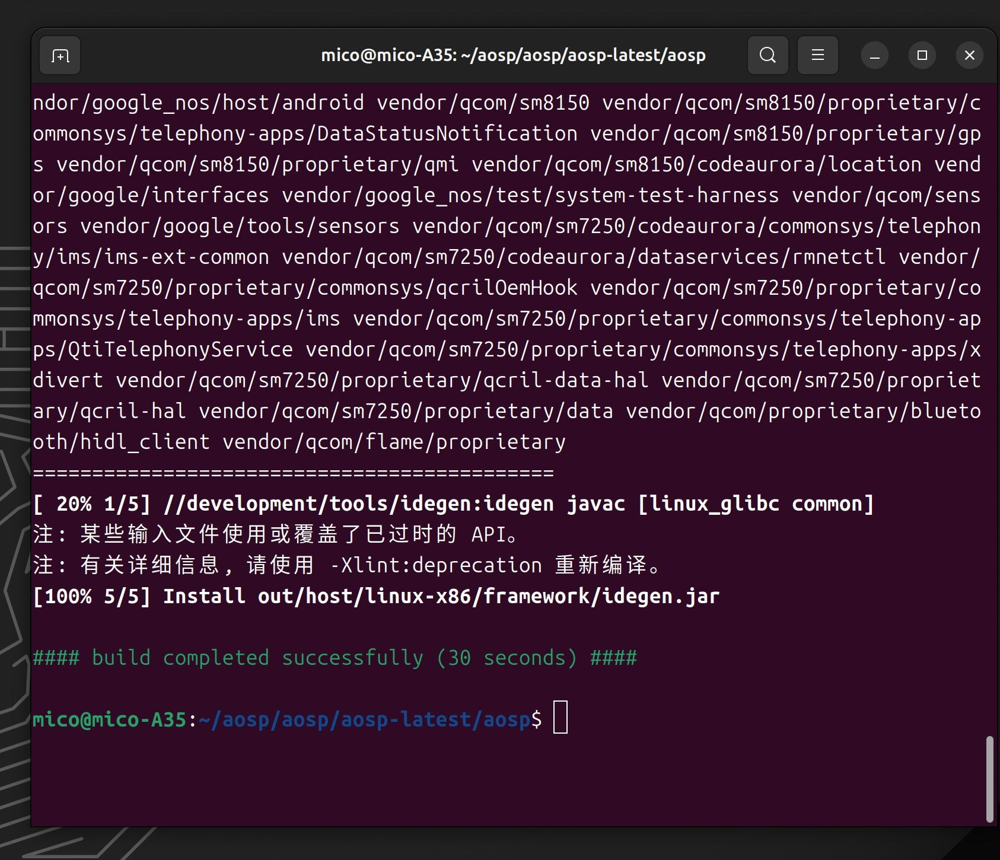
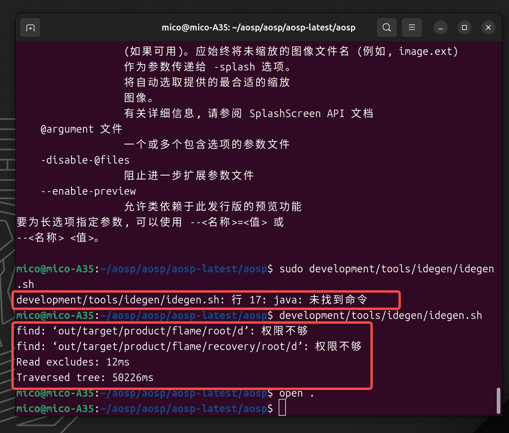

github:https://github.com/light-echo-3/light-echo-3.github.io/blob/main/AndroidStudio%E5%AF%BC%E5%85%A5Android%E6%BA%90%E7%A0%81.md

参考文档：  
https://blog.csdn.net/xct841990555/article/details/119131460  
https://blog.csdn.net/jiangxinnju/article/details/113923875  
https://blog.csdn.net/yinminsumeng/article/details/131144369

# 1.在源码中生成android studio 环境

下载好全包源码后，在源码根目录执行以下四条命令：

1. "source build/envsetup.sh" (source可以用 . 代替，即". build/envsetup.sh")
```shell
source build/envsetup.sh
```
2. "lunch"，并选择要编译的项目
```shell
lunch
```

3. "make idegen -j4" (这里的 -j4 表示用4线程来编译，可以不加)
```shell
make idegen -j4
```



4. "sudo development/tools/idegen/idegen.sh"
```shell   
sudo development/tools/idegen/idegen.sh
```
## error development/tools/idegen/idegen.sh: 行 17: java: 未找到命令
解决：  
参考：https://blog.csdn.net/jiangxinnju/article/details/113923875  
执行development/tools/idegen/idegen.sh，可能会提示权限相关问题，如果没有中断程序可以暂时忽略，有的教程建议增加sudo前缀提升命令执行权限，这里不推荐，因为之前如果source build/envsetup.sh是以普通用户执行的，所有的构建环境都是以普通用户为前提的，提升权限可能会导致问题，比如java: 未找到命令



完成以上四个步骤之后，会发现在源码根目录下出现了三个新的文件(也有可能是两个)
```
1. android.iml (记录项目所包含的module、依赖关系、SDK版本等等，类似一个XML文件)

2. android.ipr (工程的具体配置，代码以及依赖的lib等信息，类似于Visual Studio的sln文件)

3. android.iws (主要包含一些个人的配置信息，也有可能在执行上述操作后没有生成，这个没关系，在打开过一次项目之后就会自动生成了)

```


# 2. 调整配置文件，缩短导入时间
（这步很重要，影响代码的加载速度和跳转）
编辑android.iml文件，需要修改2部分内容：

1. 增加excludeFolder列表，排除不需要的源码路径，这样可以加快导入和创建文件索引的速度。在.iml文件中有少了的excludeFolder项，在后面根据自己需要补充即可。例如：

```XML
<excludeFolder url="file://$MODULE_DIR$/abi"/>
<excludeFolder url="file://$MODULE_DIR$/art"/>
<excludeFolder url="file://$MODULE_DIR$/bionic"/>
<excludeFolder url="file://$MODULE_DIR$/bootable"/>
<excludeFolder url="file://$MODULE_DIR$/build"/>
<excludeFolder url="file://$MODULE_DIR$/cts"/>
<excludeFolder url="file://$MODULE_DIR$/dalvik"/>
<excludeFolder url="file://$MODULE_DIR$/developers"/>
<excludeFolder url="file://$MODULE_DIR$/development"/>
<!-- <excludeFolder url="file://$MODULE_DIR$/device"/> -->
<excludeFolder url="file://$MODULE_DIR$/docs"/>
<excludeFolder url="file://$MODULE_DIR$/external"/>
<!-- <excludeFolder url="file://$MODULE_DIR$/hardware"/> -->
<excludeFolder url="file://$MODULE_DIR$/kernel"/>
<!-- <excludeFolder url="file://$MODULE_DIR$/libcore"/> -->
<excludeFolder url="file://$MODULE_DIR$/libnativehelper"/>
<excludeFolder url="file://$MODULE_DIR$/ndk"/>
<excludeFolder url="file://$MODULE_DIR$/out"/>
<excludeFolder url="file://$MODULE_DIR$/pdk"/>
<excludeFolder url="file://$MODULE_DIR$/platform_testing"/>
<excludeFolder url="file://$MODULE_DIR$/prebuilts"/>
<excludeFolder url="file://$MODULE_DIR$/sdk"/>
<!-- <excludeFolder url="file://$MODULE_DIR$/system"/> -->
<excludeFolder url="file://$MODULE_DIR$/tools"/>
<!-- <excludeFolder url="file://$MODULE_DIR$/vendor"/> -->
<excludeFolder url="file://$MODULE_DIR$/toolchain"/>
<excludeFolder url="file://$MODULE_DIR$/compatibility"/>
<excludeFolder url="file://$MODULE_DIR$/compatibility"/>
<excludeFolder url="file://$MODULE_DIR$/test"/>

```

说明：也可以通过修改development/tools/idegen/excluded-paths文件，增加排除的路径。


2. 删除所有<orderEntry type="module-library">...</orderEntry>项。这些项是引用的源码中编译出来的jar包，如果保留，在浏览过程中查看类型跳转到这些jar中的class文件，而不是源码java文件。删除后，则可以直接跳转到源码文件。
说明：这些设置也可以在Android studio：project structure - project settings - modules - dependencies中修改，速度比较慢，不如直接编辑.iml文件方便。
例如：

```XML
<!-- 删除所有<orderEntry type="module-library">...</orderEntry>,只保留如下配置-->
    <orderEntry type="sourceFolder" forTests="false" />
    <orderEntry type="inheritedJdk" />
    <orderEntryProperties />

```


# 3. 在Android Studio中导入工程
在Android Studio中open打开上面生成的android.ipr文件。如果完成了上面的编辑，并且仅保留所需的源码目录，加载时间会比较短。
加载完成后，可以完整的浏览、编辑代码了。
当关闭AS时，会把当前的配置和索引保存到文件android.iws中。以后再次打开工程就会很快。

修改Android Studio配置参数：


```
1. Help - Edit custom Properties:  
	（对应配置文件：~/.config/Google/AndroidStudio$version/idea.properties）
	idea.max.intellisense.filesize=100000
2. Help - Edit custom VM options：
	（对应配置文件：~/.config/Google/AndroidStudio$version/studio64.vmoptions）
	-Xms1g
	-Xmx5g

```


# 4.修改Android Studio 中源码路径。（jdk.table.xml）
参考：https://blog.csdn.net/jinmie0193/article/details/123848650  
路径：~/Library/Application Support/Google/AndroidStudio2022.3/options/jdk.table.xml
修改如下：
```XML
        <sourcePath>
          <root type="composite">
            <!-- 修改前
              <root url="file://$USER_HOME$/Library/Android/sdk/sources/android-33" type="simple" />
             -->
            <root url="file:///Volumes/sky/aosp/aosp_20231216/frameworks/base/core/java" type="simple" />
          </root>
        </sourcePath>
```

```test
路径：
/Users/hardy/Library/Android/sdk/sources/android-33/android/app/Activity.java

/Users/hardy/Library/Android/sdk/platforms/android-33/android.jar
换成
/Volumes/sky/aosp/aosp_20231216/prebuilts/sdk/33/public/android.jar

看来得自己打一个android.jar了

```


---------------
# 5.删除所有git仓库


1.删除git仓库脚本：

```python
import os
import sys
import shutil

def delete_git_folders(folder_path):
    try:
        # 前序位置删除
        folder_name = os.path.basename(folder_path)
        if folder_name == ".git" and os.path.isdir(folder_path):
            # 如果是.git文件夹，则删除整个文件夹
            if os.path.islink(folder_path):
                # 如果是符号链接，直接删除
                os.unlink(folder_path)
                print(f"Deleted-symlink: {folder_path}")
            else:
                print(f"Deleted-rmtree-begin: {folder_path}")
                shutil.rmtree(folder_path)
                print(f"Deleted-rmtree-end: {folder_path}")

        # 获取文件夹中的所有文件和子文件夹
        items = os.listdir(folder_path)
        for item in items:
            item_path = os.path.join(folder_path, item)
            # 递归
            if os.path.exists(item_path) and os.path.isdir(item_path):
                # 如果是文件夹，则递归删除其中的.git文件夹
                delete_git_folders(item_path)

    except Exception as e:
        print(f"Error: {e}")

if __name__ == "__main__":
    # 检查是否提供了足够的命令行参数
    if len(sys.argv) != 2:
        print("Usage: python3 script.py /path/to/your/folder")
        sys.exit(1)

    # 获取命令行参数作为根文件夹路径
    root_folder = sys.argv[1]

    # 调用函数删除.git文件夹
    delete_git_folders(root_folder)

```

2.android.ipr中删除元素节点“component name="VcsDirectoryMappings"”


# 6.改成资源，避免每次indexing
例如：
```xml
      <sourceFolder url="file://$MODULE_DIR$/developers" type="java-resource" />

```


