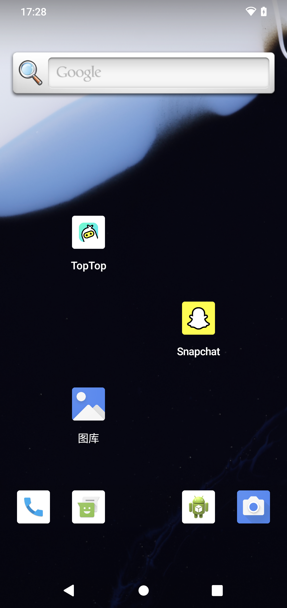

github:https://github.com/light-echo-3/light-echo-3.github.io/blob/main/%E7%BC%96%E8%AF%91Android%E7%B3%BB%E7%BB%9F.md

参考文档：https://androidperformance.com/2021/10/26/build-android-12/#/2-2-%E4%B8%8B%E8%BD%BD%E7%89%B9%E5%AE%9A-Tag-%E7%9A%84%E4%BB%A3%E7%A0%81%E6%89%80%E5%AF%B9%E5%BA%94%E7%9A%84%E9%A9%B1%E5%8A%A8  

编译代码好处：
1. 可以刷真机，方便开发者进行本地 Debug，同时代码可以导入 Android Studio 进行 Debug
可以编译 Userdebug 版本，可以 root 和 remount，方便对系统和 App 进行 Debug，Debug 模式下可  
1. 以看到许多 User 版本上看不到的问题；同时由于可以看到更多的信息，也方便进行 App 竞品分析、App 行为分析
1. 可以更方便地进行 Android 源代码的学习，本地版本可以打开很多系统级别的 Debug Log，也可以自己加 Log，或者自己修改流程

编译环境  
手机：Google pixel 4  
ubuntu版本：23.10  
要编译的系统版本：android-13.0.0_r31  

# 1.源码下载
官网：https://source.android.google.cn/source/downloading  
科大 AOSP 镜像站点地址：https://mirrors.ustc.edu.cn/help/aosp.html  
不建议使用官网，最好使用国内镜像。


## 1.1 Repo 工具下载
```shell
mkdir ~/bin
PATH=~/bin:$PATH
curl https://storage.googleapis.com/git-repo-downloads/repo > ~/bin/repo
## 如果上述 URL 不可访问，可以用下面的：
## curl -sSL  'https://gerrit-googlesource.proxy.ustclug.org/git-repo/+/master/repo?format=TEXT' |base64 -d > ~/bin/repo
chmod a+x ~/bin/repo
```
下载完成后：
编辑 ~/bin/repo，把 REPO_URL 一行替换成下面的：
```
REPO_URL = 'https://gerrit-googlesource.proxy.ustclug.org/git-repo'

```
​
## 1.2 配置git信息
如果没有安装 git，先自己安装一下 git，然后执行下面的命令，填上自己的 Name 和 Email
```shell
git config --global user.name "Your Name"
git config --global user.email "you@example.com"
```
## 1.3 源码下载--国内
参考文档：https://mirrors.ustc.edu.cn/help/aosp.html

第一次同步数据量特别大，如果网络不稳定，中间失败就要从头再来了。所以我们提供了打包的 AOSP 镜像，为一个 tar 包，大约 200G（单文件 200G，注意你的磁盘格式要支持）。这样你 就可以通过 HTTP(S) 的方式下载，该方法支持断点续传。

下载地址 https://mirrors.ustc.edu.cn/aosp-monthly/  
下载完成后：  
1.请注意对比 checksum。  
2.解压后，修改 .repo/manifests.git/config ，将
```shell
url = https://android.googlesource.com/platform/manifest
## 这里可能是url=清华的镜像网址
```
改成
```
url = git://mirrors.ustc.edu.cn/aosp/platform/manifest
```

### error:解压后，可能会出现所有文件都modified了
```shell
repo forall -vc "git config core.fileMode false --global"
```
参考：https://stackoverflow.com/a/31187212


## 1.4 同步最新代码：  

执行：
```shell
repo sync
```
然后就开始了漫长的下载，由于下载过程中可能会出现失败的情况，你可以搞一个 sh 脚步来循环下载，一觉醒来就下载好了

```shell
#!/bin/bash
repo sync -j4
while [ $? -ne 0 ]
do
echo "======sync failed ,re-sync again======"
sleep 3
repo sync -j4
done
```

 master 分支，支持的驱动程序： https://developers.google.cn/android/blobs-preview  

## 1.5 repo 将代码切到想要编译的版本的tag
repo官方文档：https://source.android.com/docs/setup/create/repo?hl=zh-cn#help  
查看支持pixel4的最新Tag：android-13.0.0_r31  
https://source.android.google.cn/docs/setup/about/build-numbers?hl=zh-cn


repo切换到代码tag：android-13.0.0_r31
```shell
repo init -b android-13.0.0_r31
repo sync   # 如果不需要与服务器数据一致，可以不运行该步（耗时）
repo start android-13.0.0_r31 --all # 创建分支：android-13.0.0_r31
```


# 2. 驱动下载
## 2.1 直接下载方式所对应的驱动
直接下载的代码使用的是 master 分支，驱动程序需要在这里下载 https://developers.google.cn/android/blobs-preview

## 2.2 下载特定 Tag 的代码所对应的驱动
地址：https://developers.google.cn/android/drivers

以我的 pixel 4 为例，下载的 TAG 为 android-13.0.0_r31 的驱动

那么我们需要找到 Tag android-13.0.0_r31 对应的 Build ID 是 TP1A.221005.002.B2 的驱动。大家可以根据自己下载的 TAG 找到对应的 Build ID，然后根据 Build ID 寻找对应的驱动即可 https://developers.google.cn/android/drivers


## 2.3 驱动提取
下载的内容解压后，是两个 sh 文件。  
将sh文件拷贝到在repo仓库（aosp）根目录，然后执行sh。  
使用 D 来向下翻页，直到最后手动输入 I ACCEPT

```shell
# 解压缩
./extract-google_devices-flame.sh
```


```shell
# 解压缩
./extract-qcom-flame.sh
```


# 3.代码编译
代码和驱动都下载好之后，就可以开始代码的编译工作了，由于新版本不再支持 Mac 编译，所以建议大家还是使用 Linux 来进行编译，推荐使用 Ubuntu


## 3.1 设置编译环境
参考：https://source.android.google.cn/setup/build/initializing
- !!!虽然官方文档说可使用“Ubuntu 18.04 及更高版本”，但实践证明更高版本会有一些问题，建议直接使用“Ubuntu 18.04”

Ubuntu 18.04 以上直接运行：

```shell
sudo apt-get install git-core gnupg flex bison build-essential zip curl zlib1g-dev gcc-multilib g++-multilib libc6-dev-i386 libncurses5 lib32ncurses5-dev x11proto-core-dev libx11-dev lib32z1-dev libgl1-mesa-dev libxml2-utils xsltproc unzip fontconfig

```
运行后报错。。。
### error1：
```
E: 无法定位软件包 libncurses5
E: 无法定位软件包 lib32ncurses5-dev
```


忽略上面错误继续编译的话，会报错：
prebuilts/clang/host/linux-x86/clang-3289846/bin/clang.real: error while loading
 shared libraries: libncurses.so.5: cannot open shared object file: No such file
 or directory
12:15:35 ninja failed with: exit status 1

解决：
https://stackoverflow.com/questions/17005654/error-while-loading-shared-libraries-libncurses-so-5


先执行命令：find /usr/lib/ -name *ncurses*，找出路径：/usr/lib/x86_64-linux-gnu/libncursesw.so.6   
所以，最终执行命令（下面两句都得执行）：   
```shell
sudo ln -s /usr/lib/x86_64-linux-gnu/libncursesw.so.6 /usr/lib/x86_64-linux-gnu/libncurses.so.5
sudo ln -s /usr/lib/x86_64-linux-gnu/libncursesw.so.6 /usr/lib/x86_64-linux-gnu/libtinfo.so.5
```

## 3.2 设置代码编译环境
每次关闭 Shell 之后都需要重新执行下面这个脚本，相当于配置了一下编译环境
```shell
source build/envsetup.sh
```
或者
```shell
. build/envsetup.sh
```

## 3.3 选择编译目标

```shell
lunch
```
运行 lunch 之后，会有一堆设备出来让你选择，还是以我的 Pixel 3 XL 为例，其代号是 ，在这里可以查看所有机型对应的代号：https://source.android.google.cn/setup/build/running#selecting-device-build
Pixel 4 对应的代号是：flame

所以我选择编译的是 aosp_flame-userdebug，  
这里可以输入编号也可以直接输入 aosp_flame-userdebug。  

然后脚本会进行一系列的配置，输出下面的内容


或者lunch的时候，直接输入:
```shell
lunch aosp_flame-userdebug
```

## 3.4 全部编译
使用 m 构建所有内容。m 可以使用 -jN 参数处理并行任务。如果您没有提供 -j 参数，构建系统会自动选择您认为最适合您系统的并行任务计数。

```shell
m
```

如上所述，您可以通过在 m 命令行中列出相应名称来构建特定模块，而不是构建完整的设备映像。此外，m 还针对各种特殊目的提供了一些伪目标。以下是一些示例：

1. droid - m droid 是正常 build。此目标在此处，因为默认目标需要名称。
1. all - m all 会构建 m droid 构建的所有内容，加上不包含 droid 标记的所有内容。构建服务器会运行此命令，以确保包含在树中且包含 Android.mk 文件的所有元素都会构建。
1. m - 从树的顶部运行构建系统。这很有用，因为您可以在子目录中运行 make。如果您设置了 TOP 环境变量，它便会使用此变量。如果您未设置此变量，它便会从当前目录中查找相应的树，以尝试找到树的顶层。您可以通过运行不包含参数的 m 来构建整个源代码树，也可以通过指定相应名称来构建特定目标。
1. mma - 构建当前目录中的所有模块及其依赖项。
1. mmma - 构建提供的目录中的所有模块及其依赖项。
1. croot - cd 到树顶部。
1. clean - m clean 会删除此配置的所有输出和中间文件。此内容与 rm -rf out/ 相同。

运行 m help 即可查看 m 提供的其他命令

输入 m 之后开始第一次全部编译，漫长的等待，编译时间取决于你的电脑配置…主要是 cpu 和内存，建议内存 32G 走起，cpu 也别太烂


编译成功之后，会有下面的输出


### error2：内存不够：
ninja: build stopped: subcommand failed
```
[100% 1/1] out/soong/.bootstrap/bin/soong_build out/soong/build.ninja
FAILED: out/soong/build.ninja
out/soong/.bootstrap/bin/soong_build -t -l out/.module_paths/Android.bp.list -b out/soong -n out -d out/soong/build.ninja.d -globFile out/soong/.bootstrap/build-globs.ninja -o out/soong/build.ninja Android.bp
Killed
07:00:40 soong bootstrap failed with: exit status 1
ninja: build stopped: subcommand failed.
```
1.内存不够：  
参照问题：
https://stackoverflow.com/questions/71984668/ninja-build-stopped-subcommand-failed   
https://blog.csdn.net/Viewz/article/details/114388530  
增加swap内存：
https://blog.csdn.net/u012514113/article/details/130978113?spm=1001.2101.3001.6650.1&utm_medium=distribute.pc_relevant.none-task-blog-2%7Edefault%7ECTRLIST%7ERate-1-130978113-blog-104921648.235%5Ev39%5Epc_relevant_3m_sort_dl_base1&depth_1-utm_source=distribute.pc_relevant.none-task-blog-2%7Edefault%7ECTRLIST%7ERate-1-130978113-blog-104921648.235%5Ev39%5Epc_relevant_3m_sort_dl_base1&utm_relevant_index=2  


# 4. 刷机
己编译的 UserDebug 固件用来 Debug 是非常方便的，不管是用来 Debug Framework 还是 App。  


编译好之后下面开始刷机,依次执行下面的命令

```shell
adb reboot fastboot

# 等待手机进入 fastboot 界面之后
fastboot flashall -w

# 刷机完成之后，执行 fastboot reboot 重启系统即可
fastboot reboot
```

### error3：执行fastboot flashall -w报错
错误信息：fastboot: error: ANDROID_PRODUCT_OUT not set  
解决：~/.bashrc文件中添加环境变量  

```shell
export ANDROID_PRODUCT_OUT=/home/xxx...xxx/aosp/out/target/product/flame
# /home/xxx...xxx/aosp/out/target/product/flame是目录编译完成后的Android系统所在的目录，其中包含”system.img,ramdisk.img,userdata.img“等
```


刷机截图如下

之后手机会自动重启，然后进入主界面，至此，我们的代码下载-编译-刷机的这部分就结束了  
自己编译的 AOSP 的 Launcher 比较丑，因为没有 Google 闭源的那些套件的加持，看上去还是很简陋的，自带的 App 非常少，而且基本上没怎么维护，给到手机厂商的就是这么一个东西



**如果在刷机的过程中遇到问题，可刷官方的刷机包拯救 ：**  
https://developers.google.cn/android/images

# 5. End
本文主要是讲如何下载、编译、刷机，后续的代码导入、修改和编译模块、代码 Debug 等，会另起一篇文章来介绍


---------------
