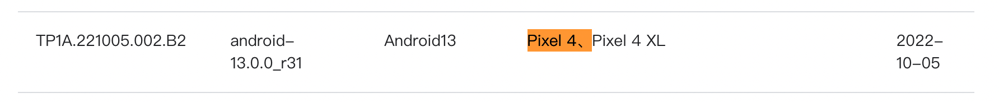
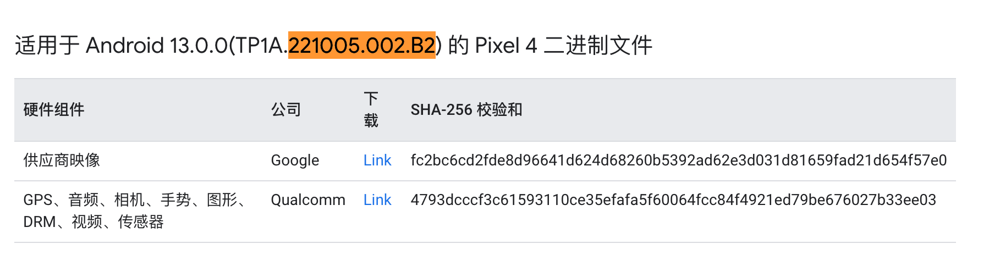
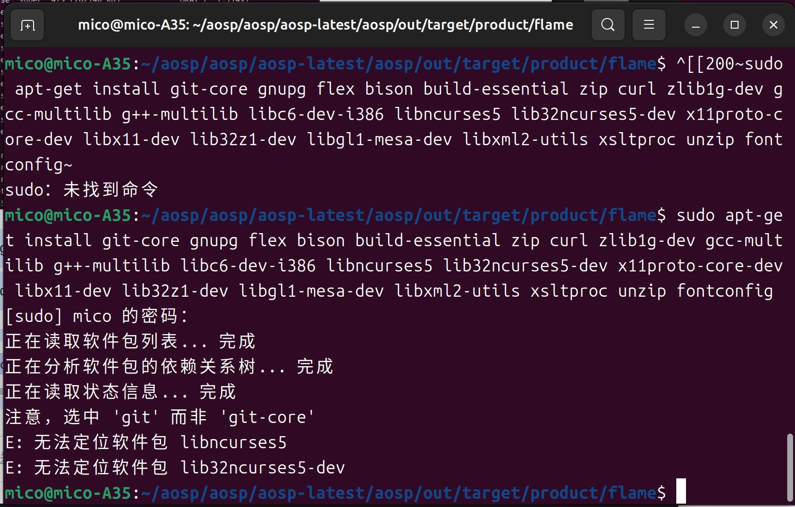
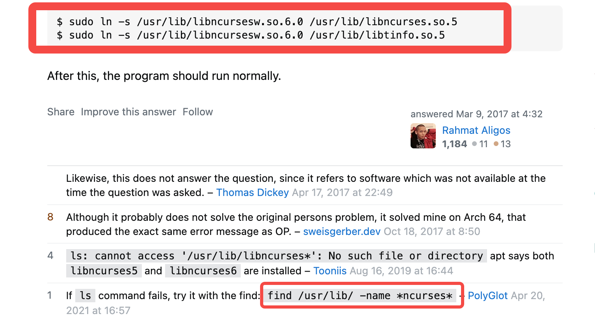

参考文档：https://androidperformance.com/2021/10/26/build-android-12/#/2-2-%E4%B8%8B%E8%BD%BD%E7%89%B9%E5%AE%9A-Tag-%E7%9A%84%E4%BB%A3%E7%A0%81%E6%89%80%E5%AF%B9%E5%BA%94%E7%9A%84%E9%A9%B1%E5%8A%A8  
编译目的：
Debug Android系统源码

手机：Google pixel 4
ubuntu版本：23.10
要编译的系统版本：android-13.0.0_r31


# 1.源码下载
官网：https://source.android.google.cn/source/downloading
科大 AOSP 镜像站点地址：https://mirrors.ustc.edu.cn/help/aosp.html
不建议使用官网，最好使用国内镜像。


## 1.1 Repo 工具下载
```shell
mkdir ~/bin
PATH=~/bin:$PATH
curl https://storage.googleapis.com/git-repo-downloads/repo > ~/bin/repo
## 如果上述 URL 不可访问，可以用下面的：
## curl -sSL  'https://gerrit-googlesource.proxy.ustclug.org/git-repo/+/master/repo?format=TEXT' |base64 -d > ~/bin/repo
chmod a+x ~/bin/repo
```
下载完成后：
编辑 ~/bin/repo，把 REPO_URL 一行替换成下面的：
```
REPO_URL = 'https://gerrit-googlesource.proxy.ustclug.org/git-repo'

```
​
## 1.2 配置git信息
如果没有安装 git，先自己安装一下 git，然后执行下面的命令，填上自己的 Name 和 Email
```shell
git config --global user.name "Your Name"
git config --global user.email "you@example.com"
```
## 1.3 源码下载--国内
参考文档：https://mirrors.ustc.edu.cn/help/aosp.html

第一次同步数据量特别大，如果网络不稳定，中间失败就要从头再来了。所以我们提供了打包的 AOSP 镜像，为一个 tar 包，大约 200G（单文件 200G，注意你的磁盘格式要支持）。这样你 就可以通过 HTTP(S) 的方式下载，该方法支持断点续传。

下载地址 https://mirrors.ustc.edu.cn/aosp-monthly/  
下载完成后：  
1.请注意对比 checksum。  
2.解压后，修改 .repo/manifests.git/config ，将
```shell
url = https://android.googlesource.com/platform/manifest
## 这里可能是url=清华的镜像网址
```
改成
```
url = git://mirrors.ustc.edu.cn/aosp/platform/manifest
```
## 1.4 同步最新代码：  

执行：
```shell
repo sync
```
然后就开始了漫长的下载，由于下载过程中可能会出现失败的情况，你可以搞一个 sh 脚步来循环下载，一觉醒来就下载好了

```shell
#!/bin/bash
repo sync -j4
while [ $? -ne 0 ]
do
echo "======sync failed ,re-sync again======"
sleep 3
repo sync -j4
done
```

## 1.5 repo 将代码切到想要编译的版本的tag
repo官方文档：https://source.android.com/docs/setup/create/repo?hl=zh-cn#help  
查看支持pixel4的最新Tag：android-13.0.0_r31  
https://source.android.google.cn/docs/setup/about/build-numbers?hl=zh-cn


repo切换到代码tag：android-13.0.0_r31
```shell
repo init -b android-13.0.0_r31
repo sync   # 如果不需要与服务器数据一致，可以不运行该步（耗时）
repo start android-13.0.0_r31 --all # 创建分支：android-13.0.0_r31
```


# 2. 驱动下载
## 2.1 直接下载方式所对应的驱动
直接下载的代码使用的是 master 分支，驱动程序需要在这里下载 https://developers.google.cn/android/blobs-preview

## 2.2 下载特定 Tag 的代码所对应的驱动
地址：https://developers.google.cn/android/drivers

以我的 pixel 4 为例，下载的 TAG 为 android-13.0.0_r31 的驱动

那么我们需要找到 Tag android-13.0.0_r31 对应的 Build ID 是 TP1A.221005.002.B2 的驱动。大家可以根据自己下载的 TAG 找到对应的 Build ID，然后根据 Build ID 寻找对应的驱动即可 https://developers.google.cn/android/drivers



## 2.3 驱动提取
下载的内容解压后，是两个 sh 文件。  
将sh文件拷贝到在repo仓库根目录，然后执行sh。  
使用 D 来向下翻页，直到最后手动输入 I ACCEPT

```shell
# 解压缩
./extract-google_devices-flame.sh
```


```shell
# 解压缩
./extract-qcom-flame.sh
```


# 3.代码编译
代码和驱动都下载好之后，就可以开始代码的编译工作了，由于新版本不再支持 Mac 编译，所以建议大家还是使用 Linux 来进行编译，推荐使用 Ubuntu


## 3.1 设置编译环境
参考：https://source.android.google.cn/setup/build/initializing

Ubuntu 18.04 以上直接运行：

```shell
sudo apt-get install git-core gnupg flex bison build-essential zip curl zlib1g-dev gcc-multilib g++-multilib libc6-dev-i386 libncurses5 lib32ncurses5-dev x11proto-core-dev libx11-dev lib32z1-dev libgl1-mesa-dev libxml2-utils xsltproc unzip fontconfig

```
运行后报错。。。
### error1：
```
E: 无法定位软件包 libncurses5
E: 无法定位软件包 lib32ncurses5-dev
```


忽略上面错误继续编译的话，会报错：
prebuilts/clang/host/linux-x86/clang-3289846/bin/clang.real: error while loading
 shared libraries: libncurses.so.5: cannot open shared object file: No such file
 or directory
12:15:35 ninja failed with: exit status 1

解决：
https://stackoverflow.com/questions/17005654/error-while-loading-shared-libraries-libncurses-so-5



先执行命令：find /usr/lib/ -name *ncurses*，找出路径：/usr/lib/x86_64-linux-gnu/libncursesw.so.6   
所以，最终执行命令（下面两句都得执行）：   
```shell
sudo ln -s /usr/lib/x86_64-linux-gnu/libncursesw.so.6 /usr/lib/x86_64-linux-gnu/libncurses.so.5
sudo ln -s /usr/lib/x86_64-linux-gnu/libncursesw.so.6 /usr/lib/x86_64-linux-gnu/libtinfo.so.5
```
